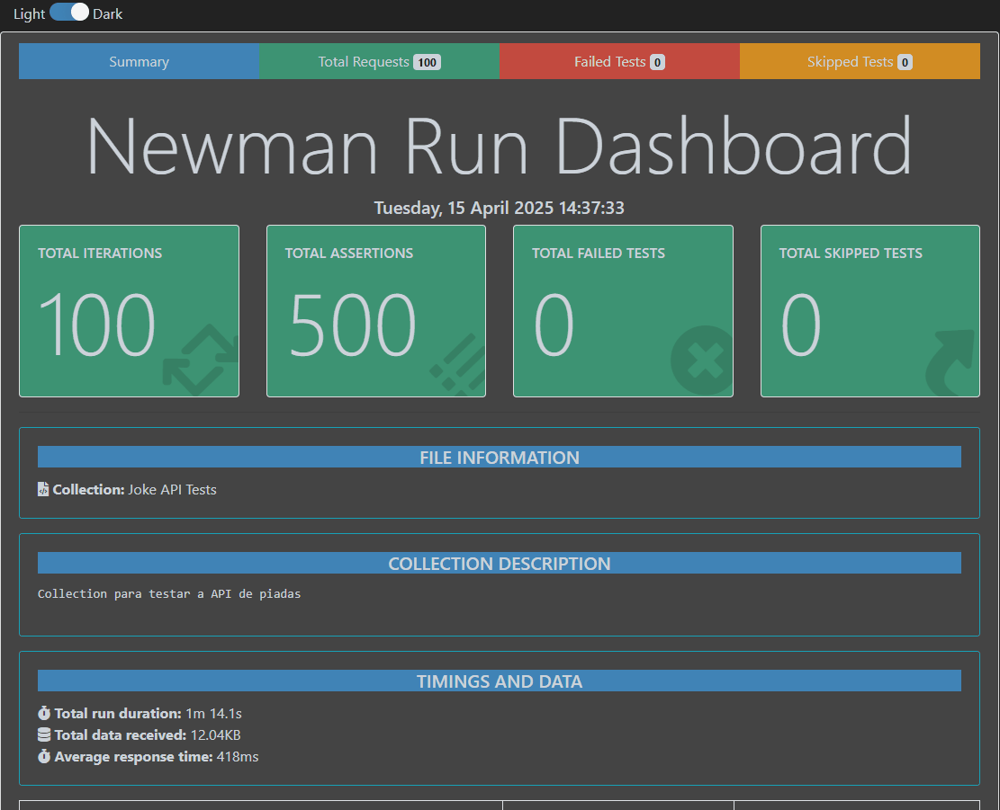

# Automação de APIs e Teste de Performance

Este repositório contém testes automatizados desenvolvidos com **Postman**, com o objetivo de **testar tespostas de API e garantir que tudo está funcionando corretamente**. Foi feito também um teste de performance com 10 VUs diferentes realizando 100 requisições.

- [Endpoint Base](https://official-joke-api.appspot.com/random_joke)


## Tecnologias Utilizadas

- [Postman](https://www.postman.com) para automação de API
- [Newman](https://www.npmjs.com/package/newman) para automação e relatório html
- [k6](https://k6.io) para teste de performance
- [k6 Cloud](https://grafana-com.translate.goog/products/cloud/k6/?_x_tr_sl=en&_x_tr_tl=pt&_x_tr_hl=pt&_x_tr_pto=tc) para realização de teste com IPs diferentes e relatório
- [VSCode](https://code.visualstudio.com) para desenvolvimento da automação
- [Google Docs](https://docs.google.com/) para criação de planejamento e relatório de teste


## Estrutura dos Testes

- **relatotio-exec/**: Relatório de execução do teste informando bugs e soluções encontradas.
- **planejamento-teste/**: Relatório em doc com casos de teste
- **report-cloud-k6/**: Relatório com dados do teste feitos no k6 cloud.


## Instalação de dependências
```bash
npm install
```
### Rodar teste automatizado + html

```bash
npm run test
```
## Rodar teste de performance localmente
```bash
npm run load:test
```
## Rodar teste de performance via nuvem com IPs diferentes simultâneos
```bash
npm run cloud:test
```

## Relatórios

Após a execução dos testes com `npm run test`, é gerados automaticamente um relatório raiz do projeto:

- `newman-report.html` – Relatório geral de execução com análise dos testes

- Você pode abrir o `newman-report.html` no navegador para visualizar o resultado da execução dos testes de forma interativa.

- 

Após a execução dos testes com `npm run cloud:test`, é disponibilizado um link no terminal com o relatório sendo gerado via k6 cloud, podendo acompanhar a execução em tempo real e também baixar o arquivo em PDF com todas as análises:
- Pasta `report-cloud-k6` – Relatório geral de execução com análise dos testes em PDF
---

## Autor

Desenvolvido por **Michael Maia**  

